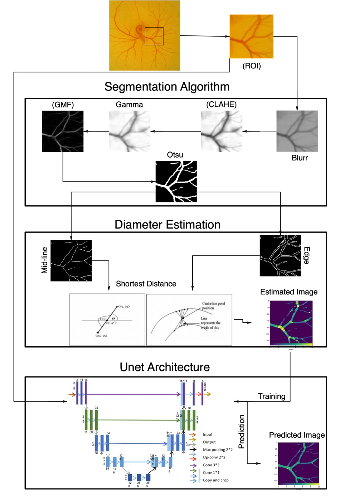

# Chick Vascular Quantification App

This app quantifies chick vascular structure within microscopy images using a computer vision and deep learning algorithm. The application is based on tkinter UI and utilises Tensorflow for the neural network. Furthemore the ability to connect a microscopy camera has been added to quantify the chick vascular structure real-time.

An overview of the workflow is given by the figure underneath:
 

**Results**
This app can be used to generate the following results based on microscopy images of atleast 256 pixels.

 

**Video**

